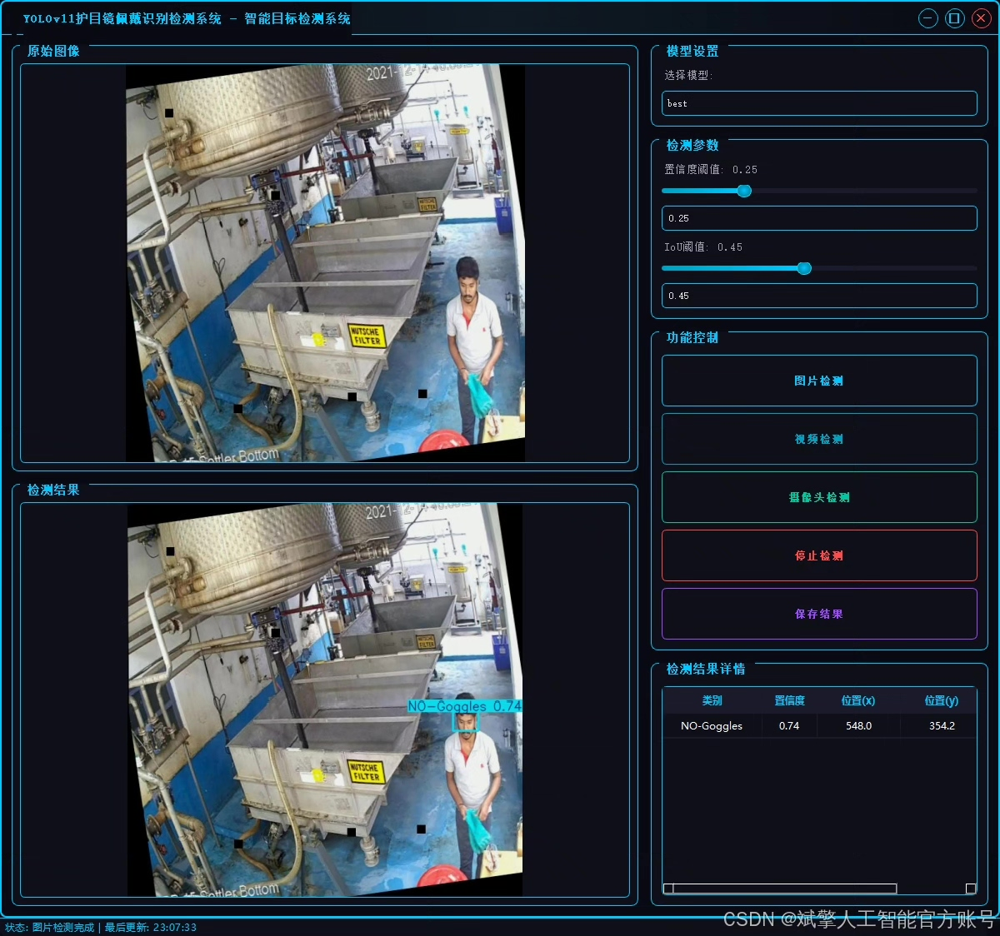
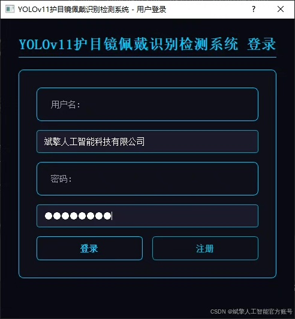
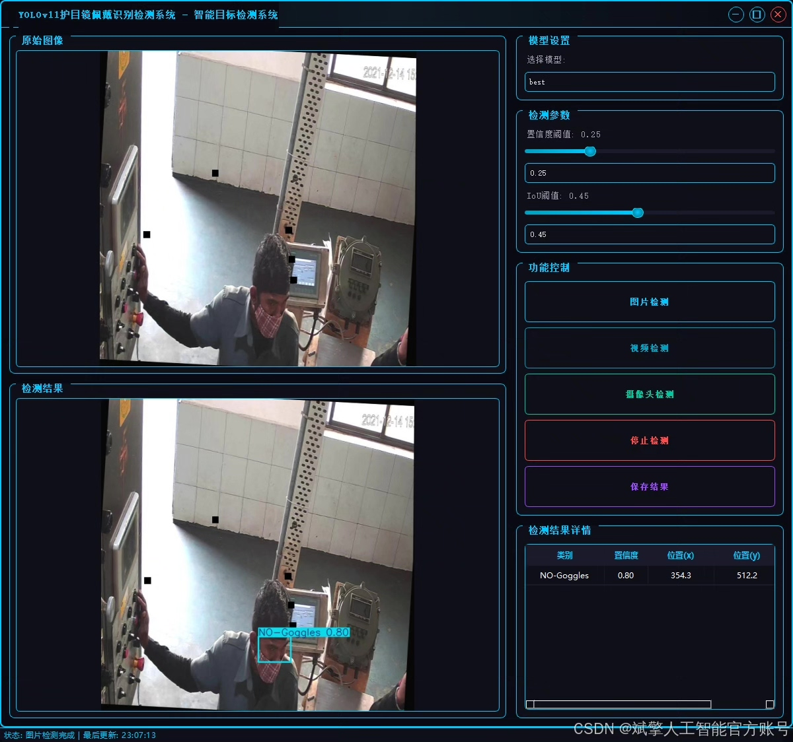
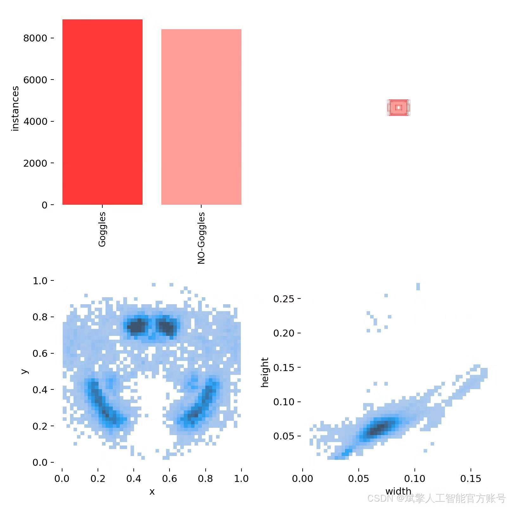
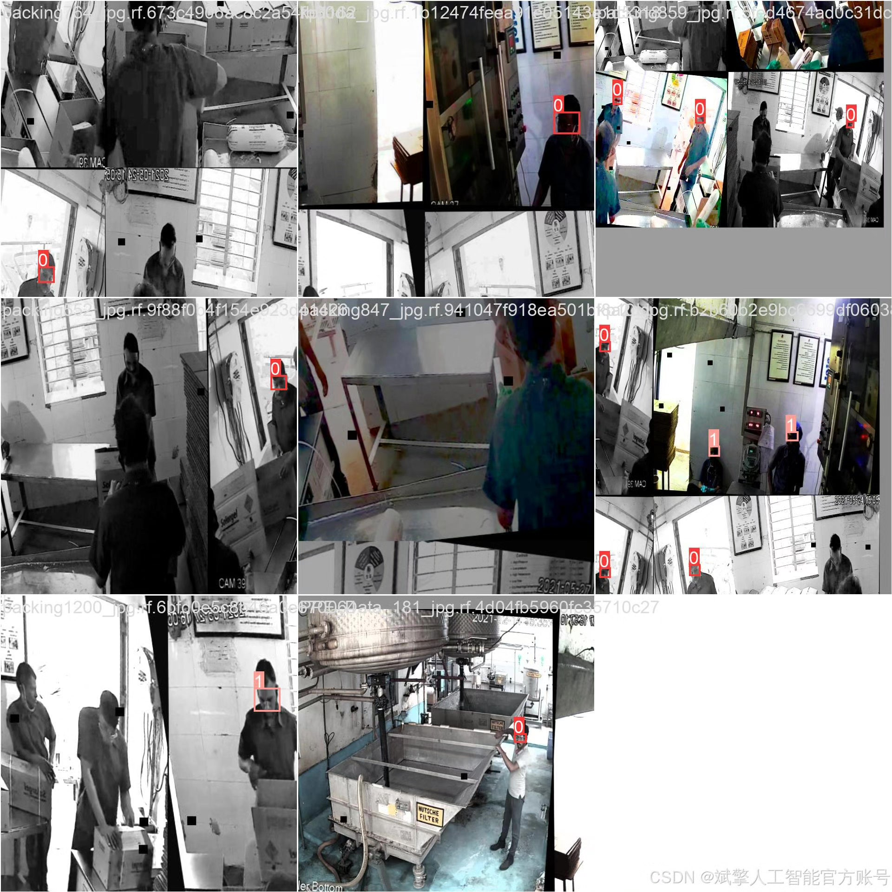
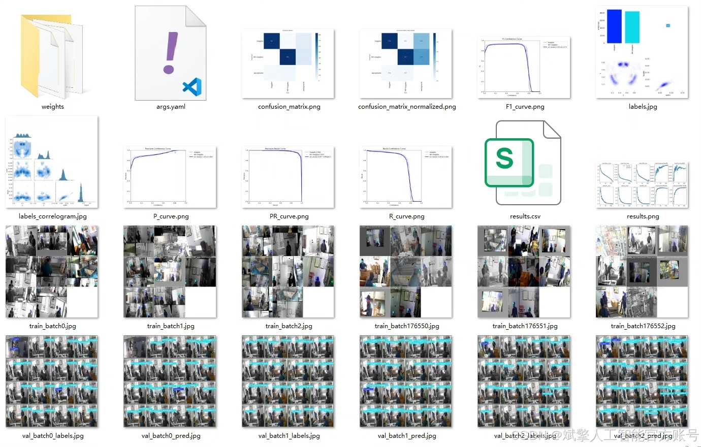
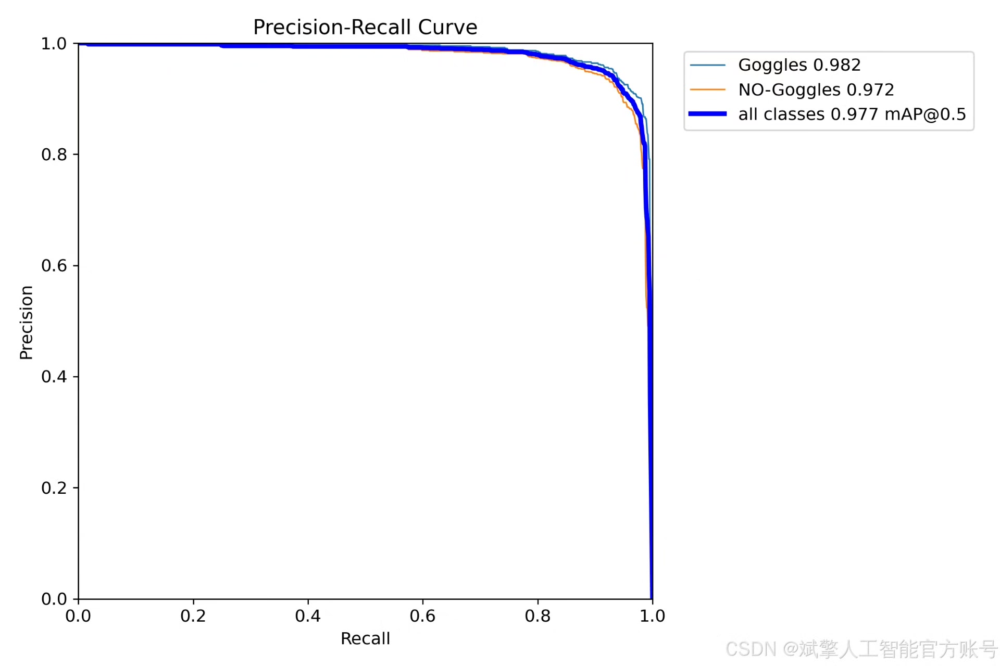
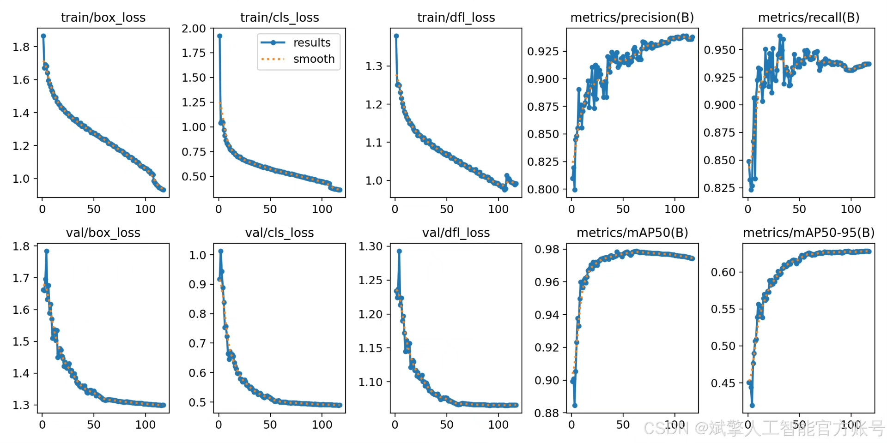
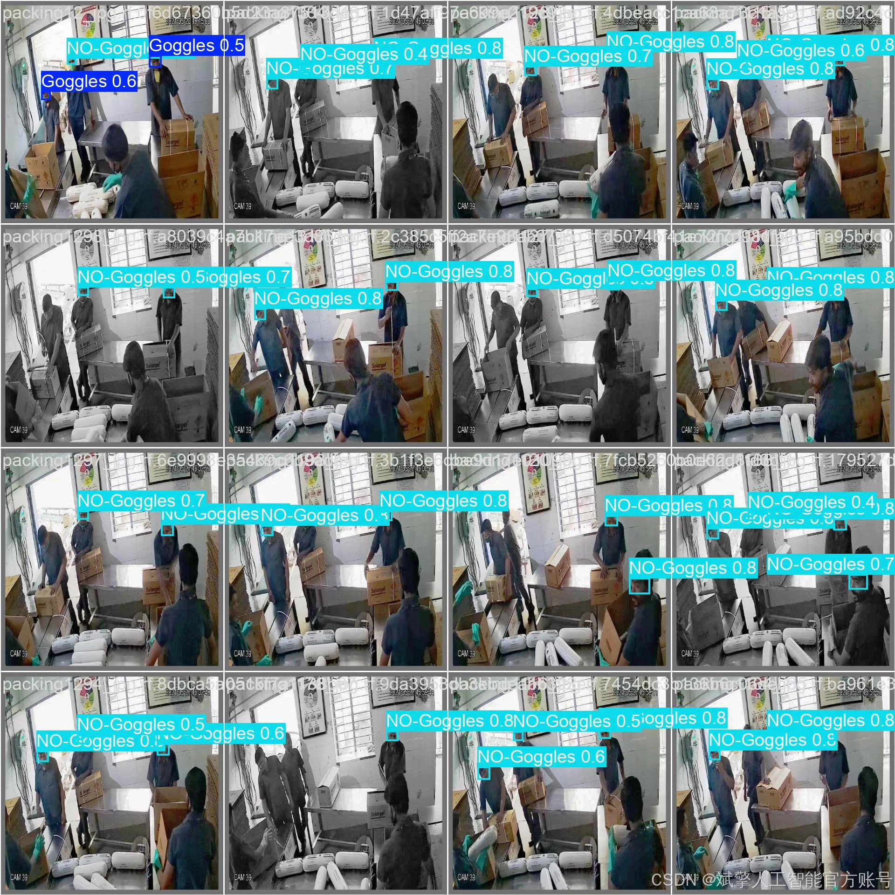

# Based on deep learning YOLOv11, a goggles wearing detection system for protection (YOLO)

## Body

Based on deep learning YOLOv11, a goggles wearing detection system (YOLOv11+YOLO dataset + UI interface + login registration interface + Python project source code + model) is designed and implemented.

This paper designs and implements a goggles wearing detection system based on deep learning YOLOv11, aiming to automatically detect whether people are wearing goggles through computer vision technology. The system uses the YOLOv11 object detection algorithm, combined with a custom dataset containing 15,083 images (training set 13,200, validation set 1,256, test set 627), for the "Goggles" (wearing goggles) and "NO-Goggles" (not wearing goggles) two categories of targets. In addition, the system integrates a user-friendly UI interface, supporting login registration functions. Experiments show that the system achieves high detection accuracy and real-time performance on the test set, can be widely used in industrial safety, laboratory management, and other scenarios, providing a solution for intelligent supervision of personal protective equipment (PPE).

✅ User login registration: Supports password detection and security verification.
✅ Three detection modes: Based on the YOLOv11 model, supports image, video, and real-time camera three detections, accurately recognizing targets.
✅ Dual screen comparison: Displays the original scene and detection results on the same screen.
✅ Data visualization: Real-time table displaying the category, confidence, and coordinates of detected targets.
✅ Intelligent parameter adjustment: Offers a confidence slide bar, dynamically optimizing detection accuracy to meet different scene needs.
✅ Sci-fi style interactive interface: Dark theme combined with dynamic light effects, reducing visual fatigue and improving operational experience.

## Images

## Payment

Here is a pay link on Stripe ( https://buy.stripe.com/3cs8yP7sY87d0vu9AB ). Please contact me lonlonago@foxmail.com after funding $89, and I will send you a complete data files , thank you!

